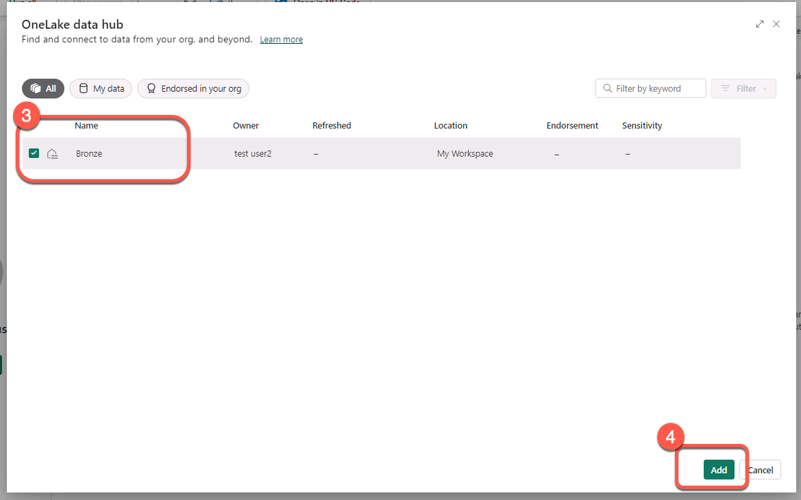

# Data Engineering: Discover the Lakehouse

**The foundation of Microsoft Fabric is a Lakehouse**, which is built on top of the **OneLake** scalable storage layer and uses **Apache Spark** and **SQL** compute engines for big data processing. A Lakehouse is a unified platform that combines:
- The flexible and scalable storage of a data lake
- The ability to query and analyze data of a data warehouse

Some benefits of a lakehouse include:
- Lakehouses use Spark and SQL engines to process large-scale data and support machine learning or predictive modeling analytics.
- Lakehouse data is organized in a schema-on-read format, which means you define the schema as needed rather than having a predefined schema.
- Lakehouses support ACID (Atomicity, Consistency, Isolation, Durability) transactions through Delta Lake formatted tables for data consistency and integrity.
- Lakehouses are a single location for data engineers, data scientists, and data analysts to access and use data.

Imagine your company has been storing structured data from NYC Taxi's transactional system, such as trip history, passenger counts, and fare information in a data warehouse. However, you have also collected unstructured data from social media, website logs, and third-party sources related to NYC Taxi, which are difficult to manage and analyze using the existing data warehouse infrastructure. Your company's new directive is to improve its decision-making capabilities by analyzing data in various formats across multiple sources. Therefore, the company decides to **leverage Microsoft Fabric's capabilities to analyze and manage these diverse datasets more efficiently.**

## Add the previously created lakehouse to the imported notebook

1. Click "Add" to add lakehouse.


2. Select "Existing lakehouse" and click "Add".


3. Select previously created lakehouse (assuming name "Bronze"), and click "Add".




## The lakehouse is attached to your notebook. It's time to discover the lakehouse artifact!

<mark> Please follow along with the instructor as they demonstrate the steps shown in the GIF.
</mark>


The GIF provided demo the steps within the lab140lakehouse workspace, with the nyc_taxi Delta table. Here are the steps detailed:
1. Unfold the "Tables" section in the interface.
2. Unfold the advanced context menu for the "nyc_taxi" Delta table.
3. Proceed to examine the "nyc_taxi" Delta table further by unfolding it to inspect the data types of specific columns.
4. Extend the "Files" section to ascertain the presence of any unprocessed, unstructured files.


The GIF provided demo the steps within the lab140lakehouse workspace, with the nyc_taxi Delta table. Here are the steps detailed:
1. Unfold the "Tables" section in the interface.
2. Unfold the advanced context menu for the "nyc_taxi" Delta table.
3. Proceed to examine the "nyc_taxi" Delta table further by unfolding it to inspect the data types of specific columns.
4. Extend the "Files" section to ascertain the presence of any unprocessed, unstructured files.


## Get data from the lakehouse

The most common way to work with data in delta tables in Spark is to use Spark SQL. You can embed SQL statements in other languages (such as PySpark or Scala) by using the spark.sql library.

<mark>Now, please follow along with the instructor as they demonstrate the steps shown in the GIF.
</mark>

 located on the left side of the code cell.

`df = spark.sql("SELECT * FROM Bronze.NYC_Taxi LIMIT 1000")` - This line of code uses the spark.sql() function to run an SQL query on a table called nyc_taxi located in the lakehouse Bronze. The query selects all columns (*) from the table and limits the result to the first 1000 rows with the LIMIT 1000 clause. The result of the query is then stored in a PySpark DataFrame called df.

`display(df)` - the display() function is used to visualize the contents of a DataFrame in a tabular format. In this case, it visualizes the contents of the df DataFrame created in the previous line.

```pyspark
df = spark.sql("SELECT * FROM Bronze.NYC_Taxi LIMIT 1000")
display(df)
```

Alternatively, you can use the %%sql magic in a notebook to run SQL statements.

```sql
%%sql
SELECT * FROM Bronze.NYC_Taxi LIMIT 1000
```

The code `df.select("vendorID", "tripDistance", "fareAmount", "tipAmount").show(5)` is used to display the first five rows of a DataFrame called df, and only the columns named: "vendorID", "tripDistance", "fareAmount", "tipAmount". This is a useful function when working with large datasets to quickly inspect the data and ensure that it has been loaded correctly.

```pyspark
df.select("vendorID", "tripDistance", "fareAmount", "tipAmount").show(5)
```

When working with data, one of the initial tasks is to read it into the environment for analysis. Once the data is loaded, basic analysis such as filtering, sorting, and aggregating can be performed. However, as the scale and complexity of the data increase, there is a need for more advanced data engineering scenarios such as data cleansing, transformation, and aggregation. 

## Data aggregation, summarization and correlation

In this scenario, the data engineer could aggregate and summarize the data to provide insights into the overall trends and patterns in the dataset. For example, they could group the data by some columns (such as VendorID or RatecodeID) and calculate some summary statistics for the numerical columns (such as average fare_amount or total trip_distance). This could involve using Spark's built-in aggregation functions (such as groupBy and agg) to perform these calculations.

The code calculates the average fare amount per month by grouping the DataFrame df by year and month of the lpep_pickup_datetime column. It uses the avg function from the [pyspark.sql.functions](https://spark.apache.org/docs/latest/api/python/reference/pyspark.sql/functions.html) module to calculate the average fare amount and aliases the resulting column as "average_fare". The resulting DataFrame average_fare_per_month is sorted by year and month and is displayed using the display function. Finally, the code saves the results to a new delta table named "average_fare_per_month" using the write function with "delta" format, and "overwrite" mode.

```pyspark
from pyspark.sql.functions import col, year, month, dayofmonth, avg

df = spark.read.table("NYC_Taxi")

# Calculate average fare amount per month
average_fare_per_month = (
    df
    .groupBy(year("lpepPickupDatetime").alias("year"), month("lpepPickupDatetime").alias("month"))
    .agg(avg("fareAmount").alias("average_fare"))
    .orderBy("year", "month")
)
display(average_fare_per_month)

# Save the results to a new delta table
average_fare_per_month.write.format("delta").mode("overwrite").saveAsTable("average_fare_per_month")
```

### Refresh Lakehouse explorer

<mark>Now, please follow along with the instructor as they demonstrate the steps shown in the GIF.
</mark>


The GIF above is based on the lakehouse named lab140lakehouse and the table named nyc_taxi, and presents the steps:
1. Expand the advanced context menu for the "Tables" section within the Lakehouse explorer.
2. Click on "Refresh".
3. Cofirm the presence of a new table named "average_fare_per_month".

### Scatter chart

This code snippet demonstrates how to create a scatter plot using Matplotlib in Python. The code assumes that the Spark DataFrame df contains the columns fare_amount and trip_distance. First, the Spark DataFrame is converted to a Pandas DataFrame using the toPandas() function. Then, a scatter plot is created using ax.scatter() function. The x and y arguments of the scatter() function represent the variables to be plotted on the x- and y-axes, respectively. The alpha argument controls the transparency of the points in the scatter plot. The axis labels and title are set using the ax.set_xlabel(), ax.set_ylabel(), and ax.set_title() functions. Finally, the plot is displayed using the plt.show() function. This code can be used to visualize the correlation between fare amount and trip distance in the DataFrame.


```pyspark
import matplotlib.pyplot as plt

# convert Spark DataFrame to Pandas DataFrame
df_pd = df.select(['fareAmount', 'tripDistance']).toPandas()

# create scatter plot
fig, ax = plt.subplots()
ax.scatter(x=df_pd['tripDistance'], y=df_pd['fareAmount'], alpha=0.5)

# set axis labels and title
ax.set_xlabel('Trip Distance')
ax.set_ylabel('Fare Amount')
ax.set_title('Correlation between Fare Amount and Trip Distance')

# show the plot
plt.show()

```