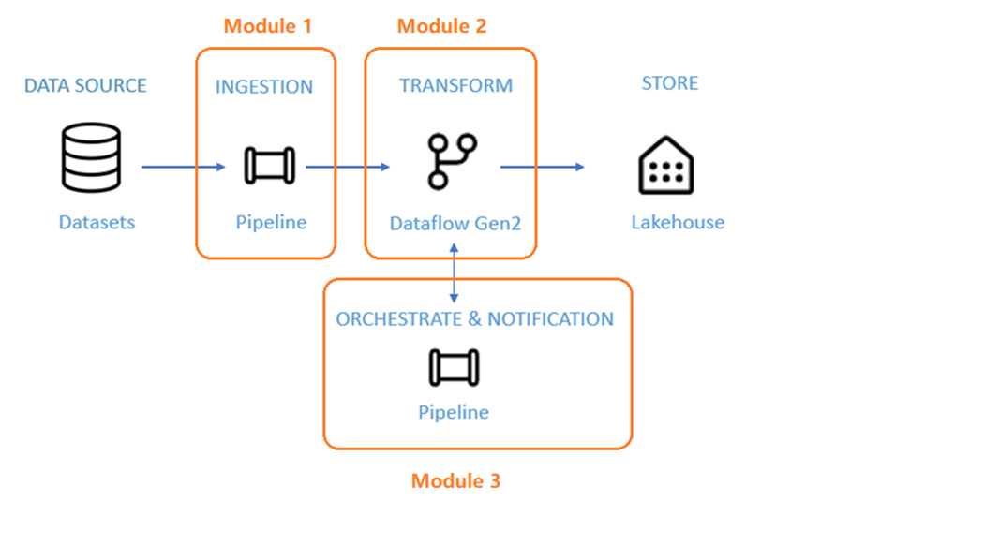

# Data Integration in an Hour Overview

This laboratory includes ingesting raw data from the source store into a table of the data Lakehouse, processing the data, moving it to the gold table of the data Lakehouse, sending an email to notify you once all the jobs are complete, and finally setting up the entire flow to run on a scheduled basis.   

The scenario is divided into the modules below:

* **Module 1**: Create your first Pipeline to ingest raw data from a Blob storage to a table in your  Data Lakehouse. 
* **Module 2**: Create your first Dataflow to process the raw data from the loaded table, merge it with other data found on the web to enrich it and create a new table that will be loaded to your Data Lakehouse as a table ready for analytical processes. 
* **Module 3**: Update your Pipeline to send an email to notify you once all the jobs are complete, and finally set up the entire flow to run on a scheduled basis. 

The sample dataset to be processed in this tutorial is “NYC-Taxi”. After going through this documentation, you'll be able to get insight into daily discounts on taxi fares for a specific period of time by using Microsoft Data Factory.

## Prerequisites

In order to complete the following instructions, you will need access to a Microsoft Fabric tenant with the Data Factory workload enabled and a workspace where you can create the artifacts needed for it such as Pipelines, Dataflows and Lakehouses.