# Module 2: Create your First Dataflow in Data Factory

With the raw data loaded into your bronze Lakehouse table from the last module, now you can prepare that data and enrich it by combining it with another table that contains discounts for each vendor and their trips during a particular day. This final gold Lakehouse table will be loaded and ready for consumption. 

The major steps in Dataflow are as follows:

* Get raw data from Lakehouse moved by upstream Copy activity
* Transform the data imported from the Lakehouse
* Connect to CSV file containing the discounts data
* Transform discounts data
* Combine trips and discounts data 
* Load the output query to a gold Lakehouse table

## Get data from Lakehouse

1.	From the sidebar, click Home to take you back to the Data Factory Home canvas. 

2.	Click **Create** and select and click on **Dataflow Gen2**.


3.	Select the **Get Data** option from the ribbon, and click the *More…*

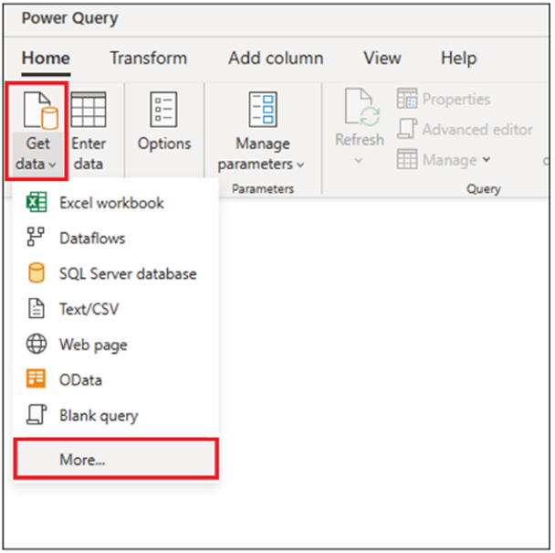

4. Search and select the **Lakehouse** connector.

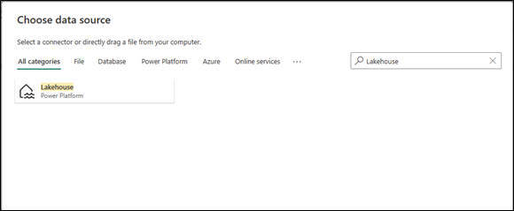

5. In the Connection settings page, an automatic connection will be created for you based on the currently signed in user. Click **Next**.

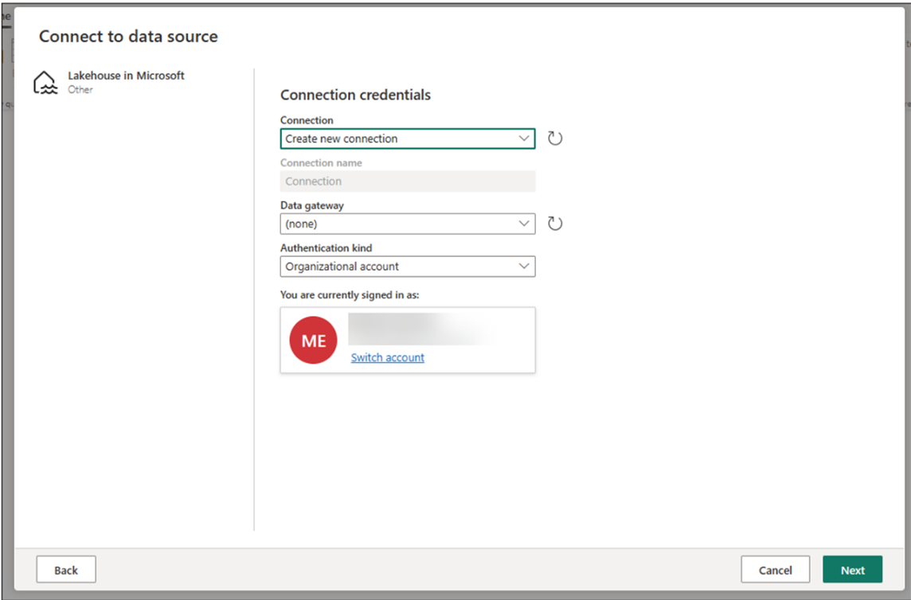

6. A navigator will be shown where you can see all the **Workspaces** available to you as well as their contents. 
To select the table that was created in Module 1, first select & expand your **Workspace Name**, select & expand your **Lakehouse Name**, and finally select your **table**.  

Click on the **Create** button on the bottom right corner.

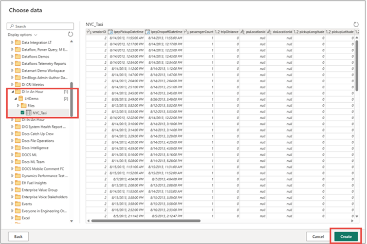

7. Once your canvas is populated with the data, you can set column profile information as this  will be useful for data profiling.  You can apply the right transformation and target the right data values based on it. (optional) 
To do this, select **Options** from the ribbon pane, then select the first 3 options under Column profile (see screen print below), then select **OK**.


## Transform the data imported from the Lakehouse

1. Select the icon in the column header of the second column **lpepPickupDatetime** to display a dropdown menu and select the data type from the menu to convert the column from the *datetime* type to *date* type.

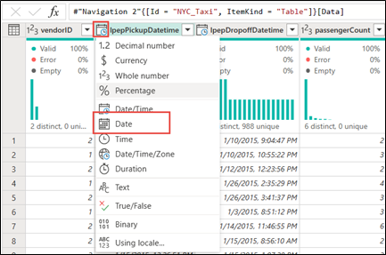

2. In the **Home** tab of the ribbon, select the **Choose columns** option from the Manage columns group. 

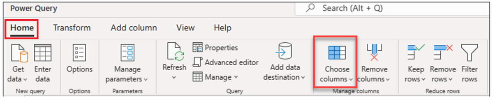

3. Inside the **Choose columns** dialog, deselect the following columns, then click **OK**.

* lpepDropoffDatetime
* puLocationId
* doLocationId
* pickupLongitude
* pickupLatitude
* dropoffLongitude
* dropoffLatitude
* rateCodeID


4. Select the **storeAndFwdFlag** column drop down menu. 

    **Note**: If you get a message “List may be incomplete”, click Load more to see the value ‘Y’

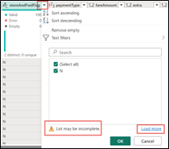

5. Choose **Y** as we want to filter to only contain the rows with the value **Y** as   the discount only applies to the rows where this is true.  Click **OK**.

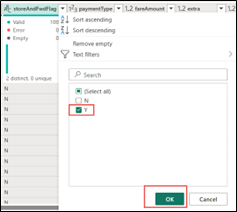

6. Select the **lpepPickupDatetime** column drop down menu, select **Date filters**, and select the **Between…** filter from the contextual filter.

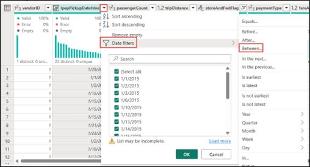

7. In the filter rows dialog, select only the dates within the month of **January of the year 2015**, then click OK.


## Connect to CSV file containing the discounts data

Now with the data from the trips in place, we want to load the data that contains the respective discounts for each day and VendorID and prepare such data before combining it with the trips data.

1. From the **Home tab** in the ribbon, select the **Get Data** option and from the submenu select the **Text/CSV** option.

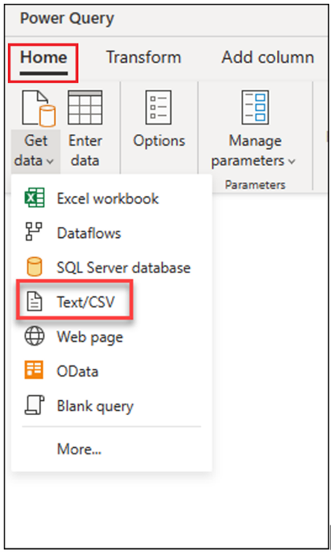

2.	Inside the connection settings for the connector, enter the following and then hit **Next**:
* **url** = https://raw.githubusercontent.com/ekote/azure-architect/master/Generated-NYC-Taxi-Green-Discounts.csv
* **Authentication kind** = *Anonymous*

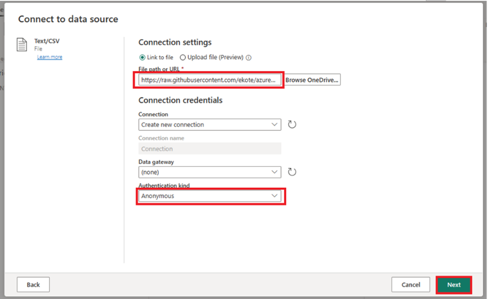

3. Inside the Preview file data, click the **Create** button.

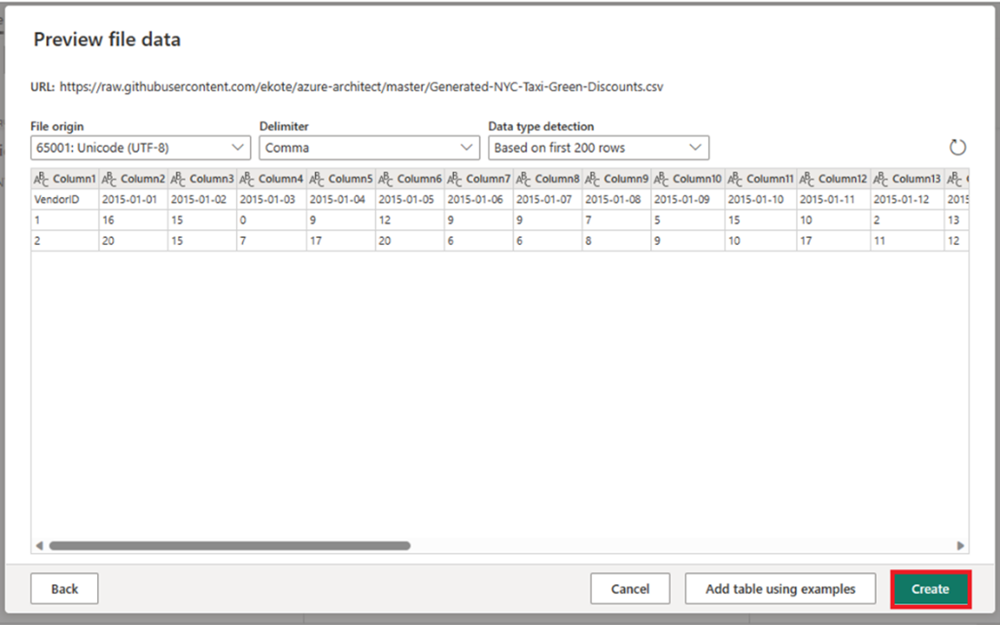

## Transform discounts data

1.	The headers appear to be in the first row. Promote them by clicking the *contextual table menu* in the Data Preview grid and select the option that reads **Use first row as headers**.

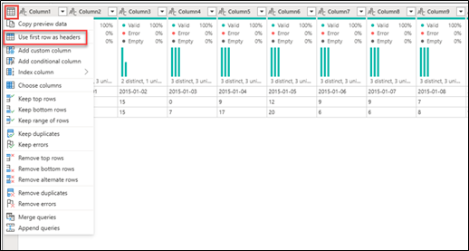


    **Note**: after promoting the headers, you will notice that a new step will be added to your Applied steps pane to set the data types of your columns

2.	Right-click the **VendorID** column and from the contextual menu select the option that reads **Unpivot other columns**. This allows you to transform columns into attribute-value pairs, where columns become rows.

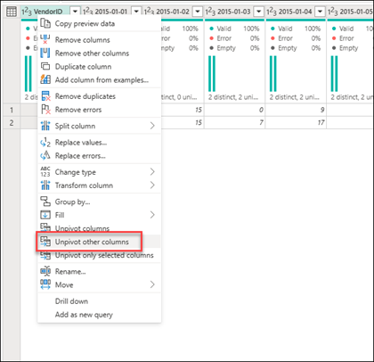

3.	With the table unpivoted, **rename the columns** by double clicking them and using the new names below:
	
* Attribute -> Date
* Valuw -> Discount

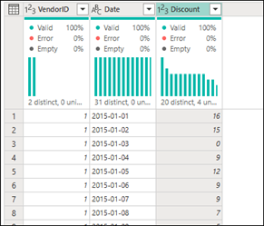

4. Change the data type of the column **Date** to be a *date* type

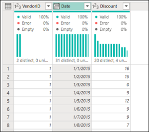

5. Select the **Discount** column, go to the Transform tab in the ribbon. In the *number column* group, select the *Standard* option and from the dropdown select **Divide**.

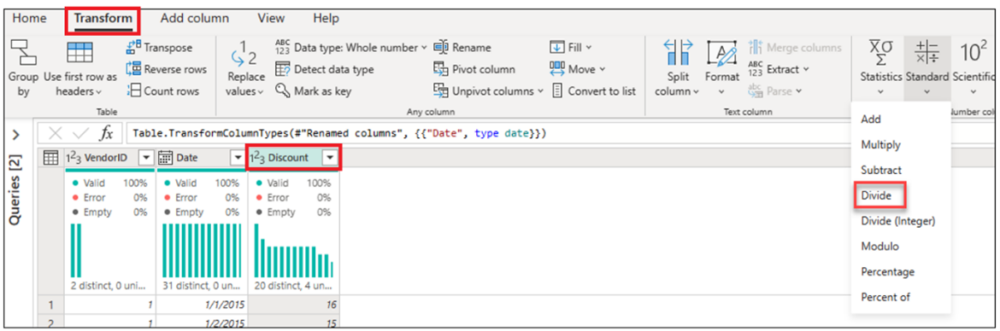

6. Inside the Divide dialog, enter the value 100.

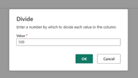

## Combine trips and discounts data

The next step is to combine both tables into a single table that has the discount that should be applied to the trip as well as the adjusted total. 

Before doing so, at the bottom right hand of the Power Query editor, click the button (in the right bottom corner) to toggle on the **diagram view** so you can see both of your queries.

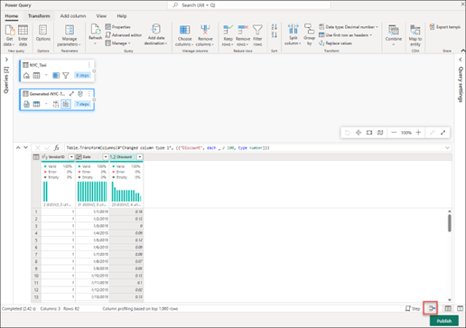

This view allows you to understand how your two queries are connected with each other as well as having a general view of how your dataflow is structured.

1. Select the NYC_Taxi query and in the Home tab, select the option to *Merge* from within the Combine group and select the option for **Merge queries as new**.

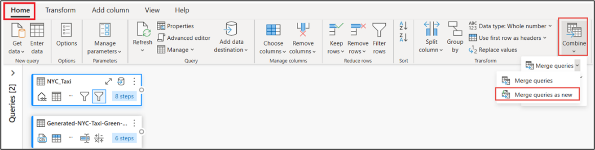

2. Inside the Merge dialog, select the “Right table for merge” to be the {Generated-NYC-Taxi-Green_Discounts} and once this table is selected click the *light-bulb* icon on the top right to see the suggested mapping of columns.

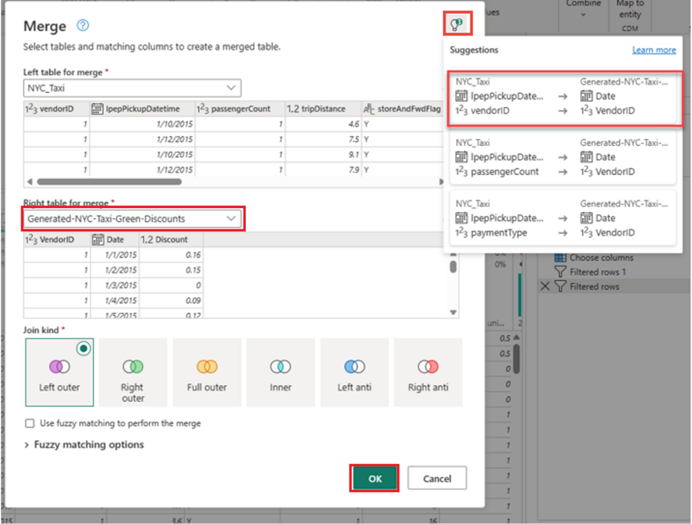

    From the suggestion, pick the one that has the following mappings:
    *	lpepPickupDate -> Date
    *	vendorID -> VendorID

3. Click **OK** when prompted to allow combining data.

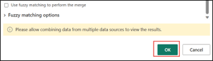

4.	When prompted to allow combination of data sources, click on the **Continue** button.

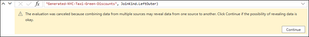

5. Notice how in the Diagram view a new query was created and it shows the relationship of the new Merge query with the two that we previously created. You can scroll to the right of the Merge query and note that a new column with table values is present. This is the “Generated-NYC-Taxi-Green-Discounts" column. In the column header there’s an icon with two arrows going in opposite directions. Click on the icon and from the menu only select the *Discount* column only and click **OK**.

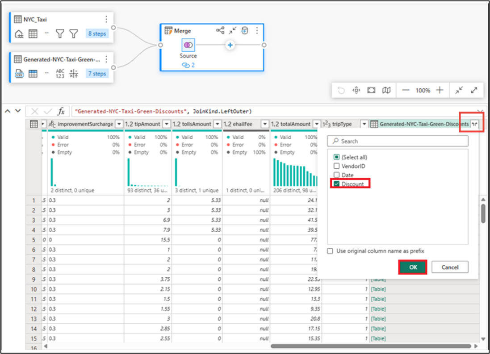

    **Note**: what this operation does is simply expand the contents that were inside of the table values to be new columns in the outer table.

6. With the discount value now at the row level, we can create a new column to calculate the total amount after discount. To do so, go to the ribbon and select the **Add column** tab. Select the option that reads **Custom column** from within the General group.


7.	Inside the Custom column dialog, you are able to use the Power Query formula language (also known as M) to define how your new column should be calculated. Input the values as follows:

* **New column name** = TotalAfterDiscount
* **Data type** = Decimal number
* **Custom column formula** = ```if [totalAmount] > 0 then [totalAmount] * ( 1 -[Discount] ) else [totalAmount]```

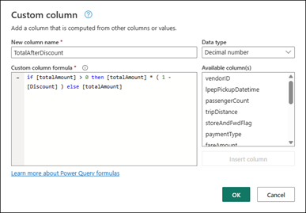

    **Note**: what this formula does is check if the totalAmount column is a negative number, effectively a credit, and keeps the same value. If it’s not, then it simply calculates the new total amount by applying the correct discount.

8. Select the newly created **TotalAfterDiscount** column and go to the Transform tab from the ribbon. Inside the transform tab, select the **Rounding…** option inside the submenu for the Rounding option in the Number column group. 

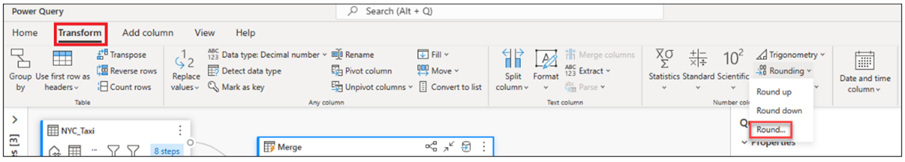

9. Inside the Round dialog, input the value 2 and hit OK.

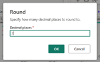

10. Change the data type of the **lpepPickupDatetime** from *Date* to *Date/Time*.

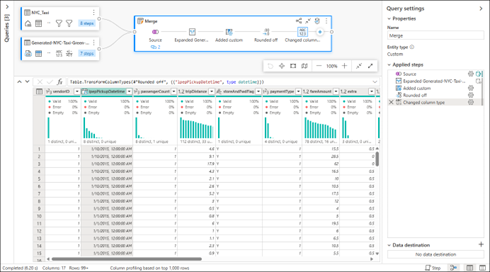

11.	Rename the query from Merge to Output by double clicking on the query name.

## Load the output query to a table in the Lakehouse

With the output query now fully prepared and with the data that we’re looking to load, we can proceed to define the output destination for the query.

1.	Select the **Output** query and from the Home tab select the **Add data destination** option. Pick the *Lakehouse* option from the submenu:

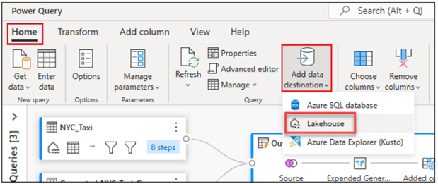

2. When prompted inside the Connect to data destination dialog, the connection should be automatically populated and you can click **Next**.

3. In the **Choose data destination target** dialog, select the Lakehouse where you wish load the data and give your new table name *MyOutputTable* and click **Next**.

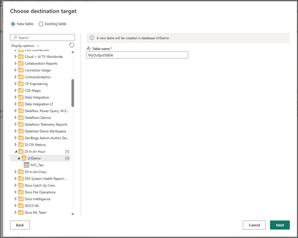

4. Inside the **Choose data destination settings**, use *Replace* as the **Update method** and make sure that all columns are correctly mapped. Click the **Save settings** button.

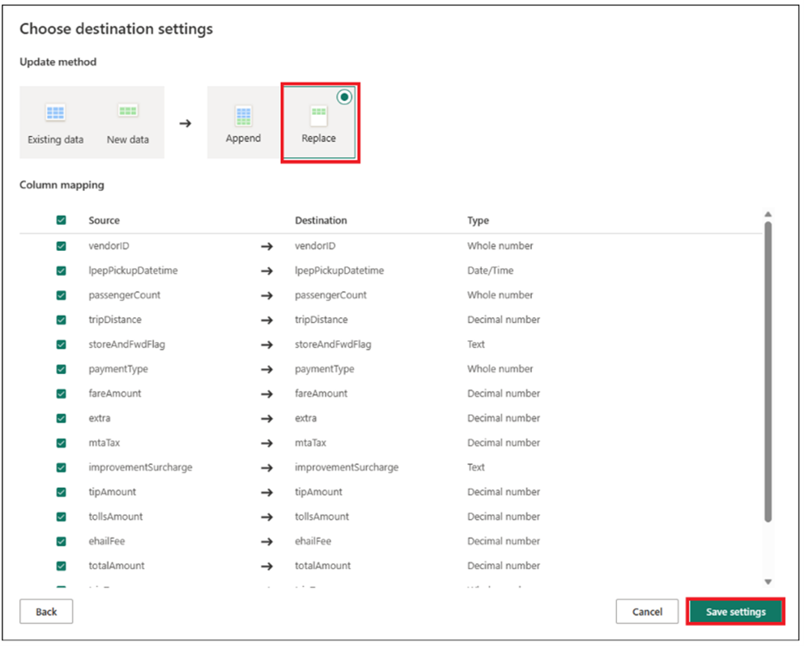

5. Once again in the Power Query Editor, you should be able to see that your Output query now has some icons related to the output destination selected. Click on **Publish**.

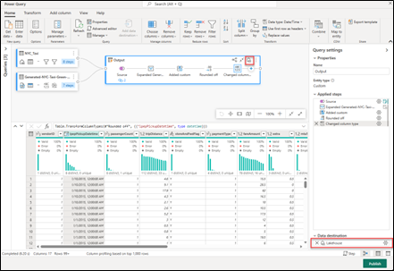

6. In the workspace list, rename your dataflow to a name of your choice by hovering over the dataflow and selecting the ellipsis which will display the **Properties** option.

7. Refresh your dataflow, and then you should see your Lakehouse table created in your Lakehouse. 

8. Check your Lakehouse to view the new table loaded to it.