# Module 3: Complete Your First Data Integration Journey 

Tasks to be completed in this module:

* Add office outlook activity to send the output of copy in email 
* Add schedule in the pipeline
* Add dataflow activity into the same pipeline

## Add office outlook activity

We will use the same Pipeline created in Module 1, as its name is **First_Pipeline**.

1. Click **Activities** and scroll over until you see the **Office365 Outlook**. Then click on the Office365 Outlook activity.

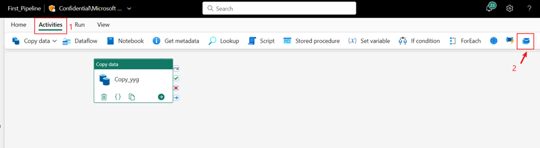

2. Click **OK** to grant consent to use your e-mail address.

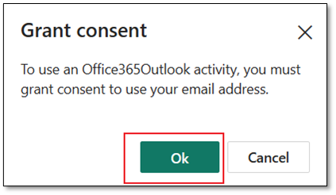

3. Select the e-mail account you want to use. 

    Note: we currently do not  support personal e-mail.  You must use your corporate e-mail address.

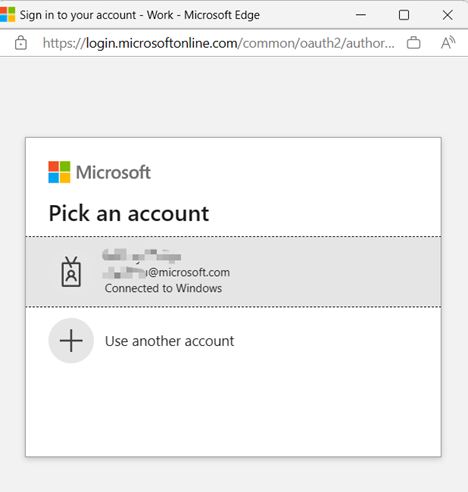

4. Click Allow access to confirm.

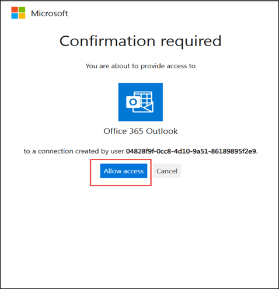

5. Drag “On Success” from your Copy Activity to the Office365   Outlook Activity.

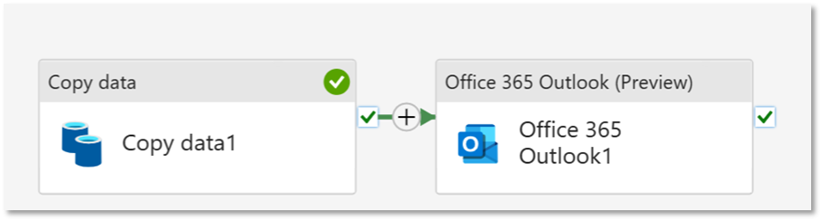

6. Click on the Office365 Outlook Activity configure the email.

### Configuring the Office Outlook activity

1. Click on settings
2. In the “To” section of the e-mail template, enter your e-mail address. If you want to fill in several email addresses, you can use ; to separate several email addresses (for example email1@microsoft.com; email2; email3)
3.  In the “Subject” section, click your mouse to allow the Add dynamic content option to appear, then click on the option.

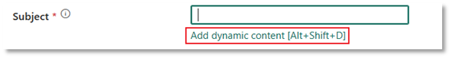

The Pipeline expression builder canvas will appear, and enter below command, then click **OK**.  
```@concat('DI in an Hour Pipeline Succeeded with Pipeline Run Id', pipeline ().RunId)```

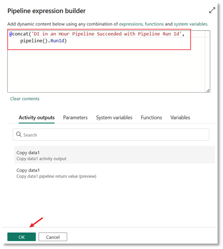

4. In the **Body** section, click your mouse to allow the *add dynamic content* option to appears.  Then click on the option and enter below content, then click OK.

Note: Please replace Copy data1 with your own pipeline copy activity name.

    @concat('RunID =  ', pipeline().RunId, ' ; ',
    'Copied rows ', activity('Copy data1').output.rowsCopied, ' ; ','Throughput ', activity('Copy data1').output.throughput
    )

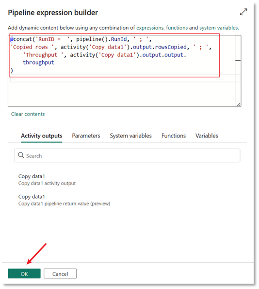

5. Then click **Run** and then **Save and Run** to execute these activities

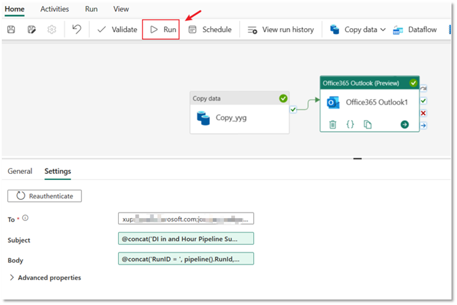

6. After running successfully, please check your email to see the sent email in your mail box.

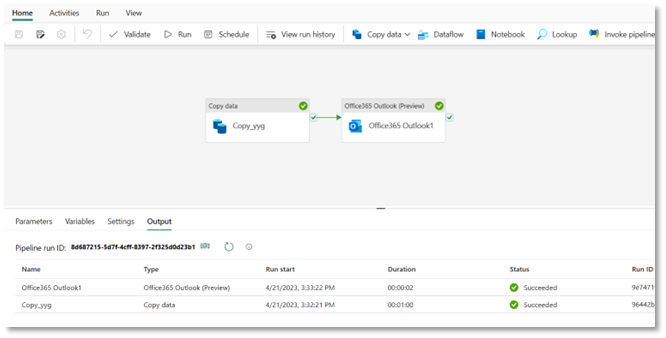

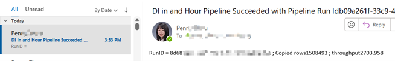

## Add schedule in the Pipeline

Once you complete the development and testing of your pipeline, you can schedule the pipeline to execute automatically.

Once you complete the development and testing of your pipeline, you can schedule the pipeline to execute automatically.

1. In the Home tab of the ribbon, click the **Schedule** button.

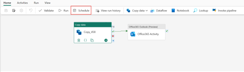

2. Enter the scheduling information and click **Apply**.

The example below schedules the Pipeline to execute daily at 8:00 PM until the end of the year.

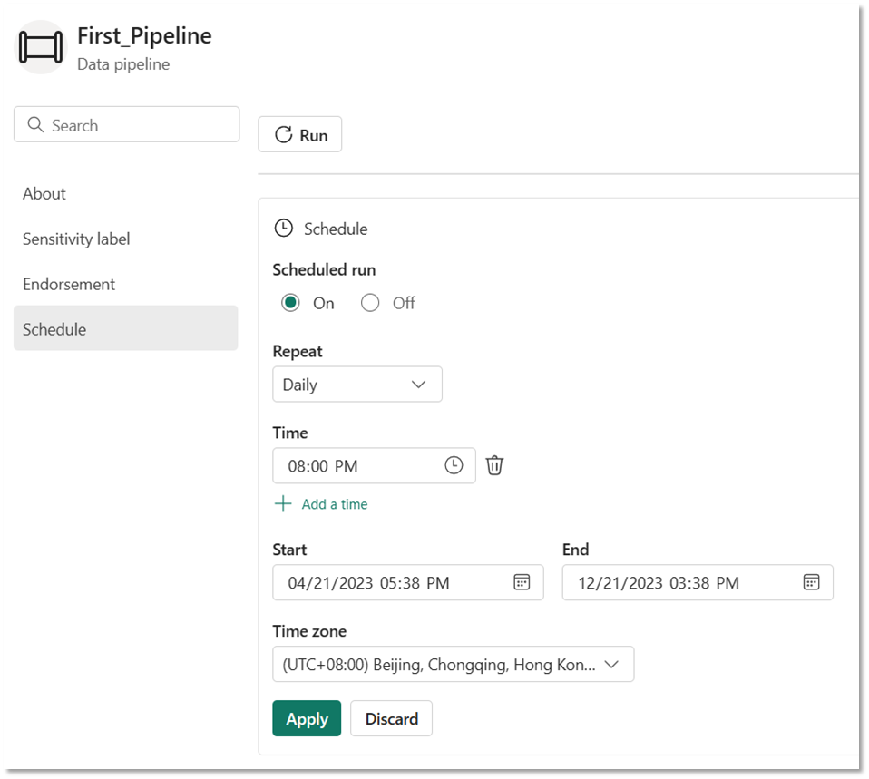

## Add dataflow activity into the Pipeline 

You can also add the dataflow created in Module 2 into the pipeline as below.

1. Click + between you copy activity and Office Outlook activity, and select **Dataflow** in order to add your dataflow activity in between.

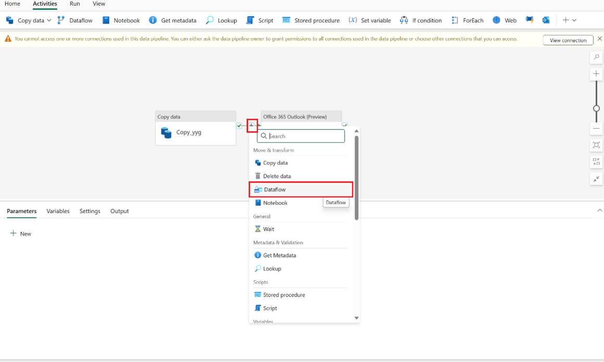

2. Click **Settings** tab, and select your Dataflow created in Module 2.

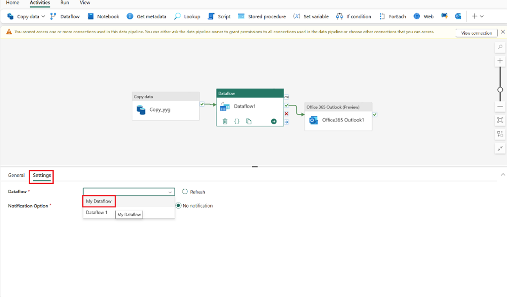

Now you have created a pipeline to complete an end-to-end data integration scenario including using copy activity to ingest raw data from the source store into the bronze table of the data Lakehouse using dataflow activity to process the data and move it to the gold table of the data Lakehouse, using office outlook activity to send an email to notify you once all the jobs are complete, and finally setting up the entire flow to run on a scheduled basis.   